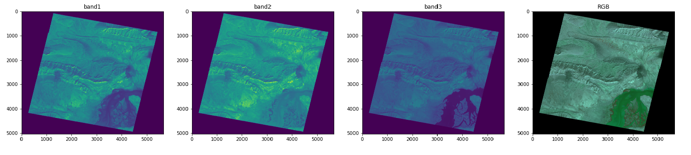
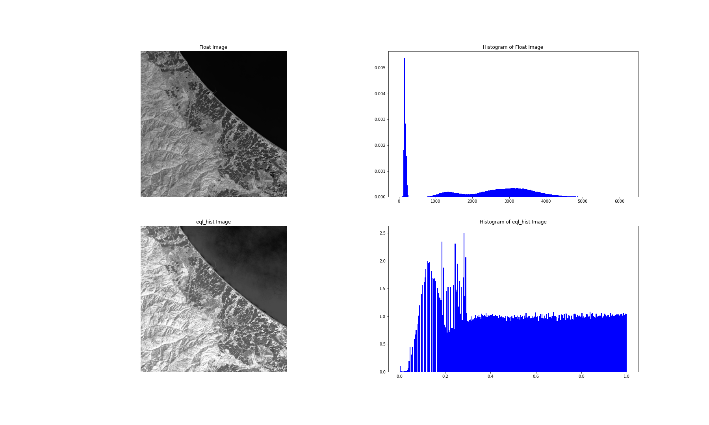
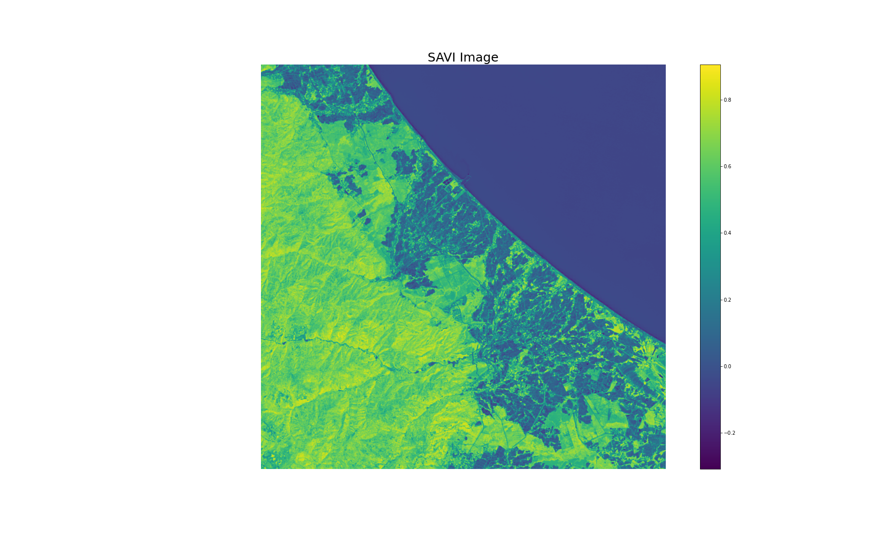
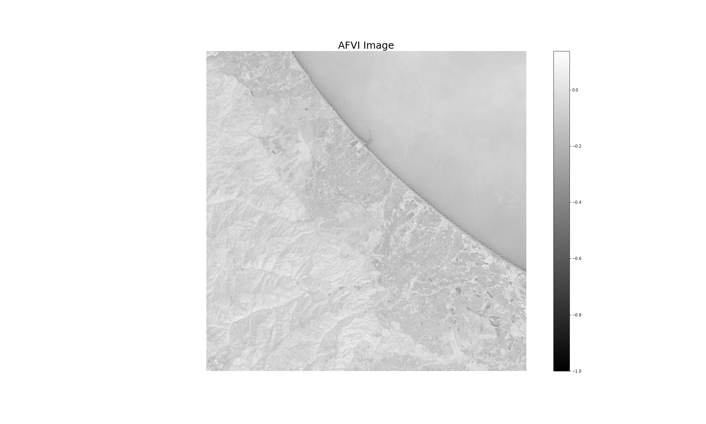

# KAVOSHGARAN COMPANY
- [kavoshgaran.org](http://kavoshgaran.org/)

- [Image Processing](https://github.com/MohammadMahdiOmid/Virtual-Irrigation/tree/master/Image_processing)
  - [NC](https://github.com/MohammadMahdiOmid/Virtual-Irrigation/tree/master/Image_processing/NC)
  
  - [PCA](https://github.com/MohammadMahdiOmid/Virtual-Irrigation/tree/master/Image_processing/PCA_algorithm)
  
  - [HSV](https://github.com/MohammadMahdiOmid/Virtual-Irrigation/tree/master/Image_processing/hsv)

  - [Image Inhancement](https://github.com/MohammadMahdiOmid/Virtual-Irrigation/tree/master/Image_processing/image_inhancement)

  - [Import Satellite](https://github.com/MohammadMahdiOmid/Virtual-Irrigation/tree/master/Image_processing/import_image_satellite)
  - [Indices](https://github.com/MohammadMahdiOmid/Virtual-Irrigation/tree/master/Image_processing/indices)
  - [Mask](https://github.com/MohammadMahdiOmid/Virtual-Irrigation/tree/master/Image_processing/mask)
  - [Mosaic](https://github.com/MohammadMahdiOmid/Virtual-Irrigation/tree/master/Image_processing/mosaic_file)
  - [Spectral Profile](https://github.com/MohammadMahdiOmid/Virtual-Irrigation/tree/master/Image_processing/spectral_profile)
  - [README](https://github.com/MohammadMahdiOmid/Virtual-Irrigation/blob/master/Image_processing/ReadMe.md)
 

- [Machine Learning Directory](https://github.com/MohammadMahdiOmid/Virtual-Irrigation/tree/master/Machine_learning)
  - [Supervised Learning](https://github.com/MohammadMahdiOmid/Virtual-Irrigation/tree/master/Machine_learning/supervised%20learning)
  - [Unsupervised Learning](https://github.com/MohammadMahdiOmid/Virtual-Irrigation/tree/master/Machine_learning/unsupervised%20learning)
  - [README](https://github.com/MohammadMahdiOmid/Virtual-Irrigation/blob/master/Machine_learning/ReadMe.md)

# Virtual-Irrigation
Machine Learning &amp; Image Processing

# Landsat image
Getting landsat images with scikitImage(skimage.io)

# Modis image 

# Geo image

# Aster image

# Image Inhancement
To getting images with their histogram(bios)

# Histogram

# Gamma

# Adjust Logarithm

# Equalize Adaptive

# Equalize Histogram

# Adjust Sigmoid

# Mosaic
merge two mosaic images

# HSV(RGB2HSV)
with skimage(rgb2hsv)

# Spectral profile
#### Using OpenCv and Scikit_Image
https://user-images.githubusercontent.com/78675207/128985724-92295a94-ff6d-4060-9cd5-b942a66cfa64.mp4

# PCA Algorithm

# INDICES
### NDVI 

### NDWI

### SAVI 

### AFVI 

### UI 

### DIFFERENCES

