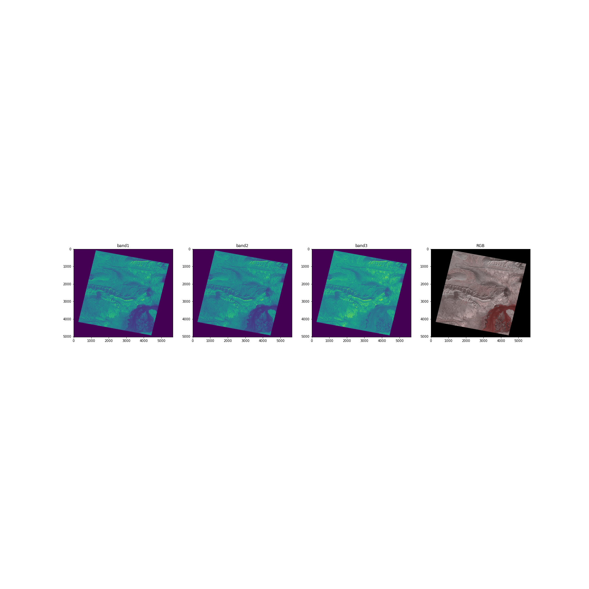
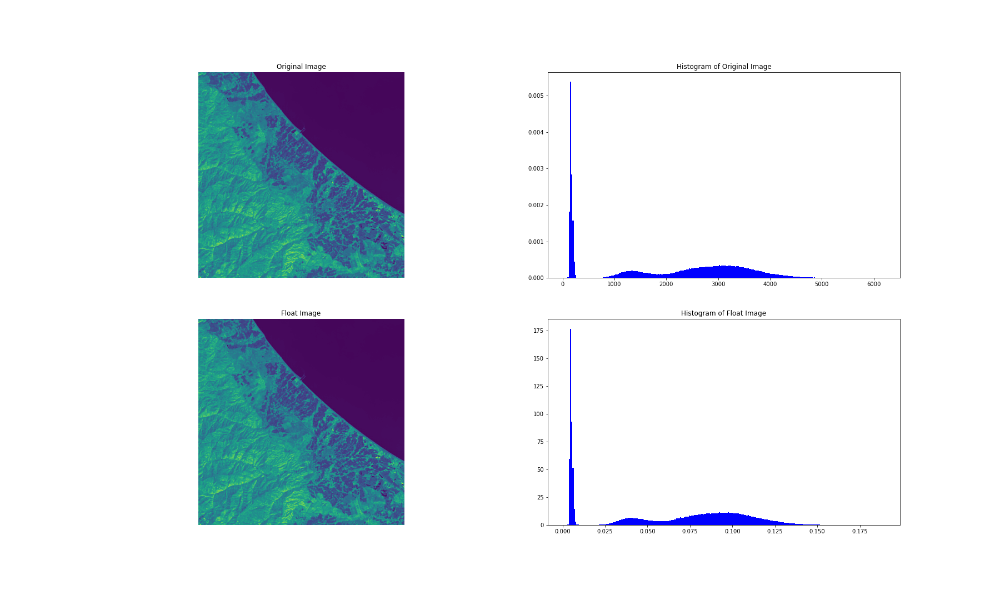
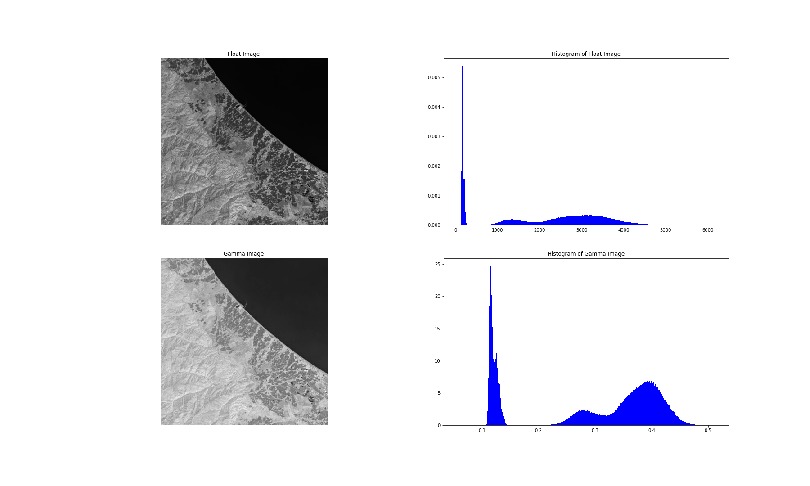
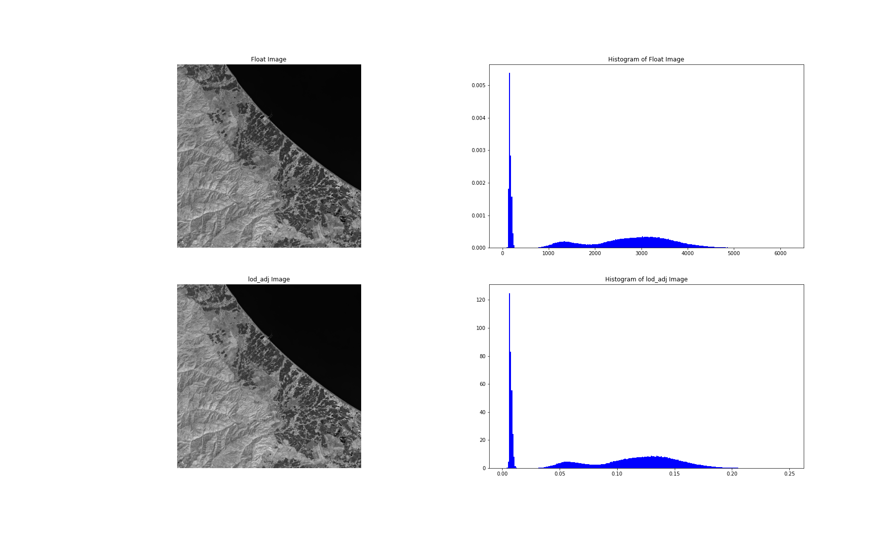
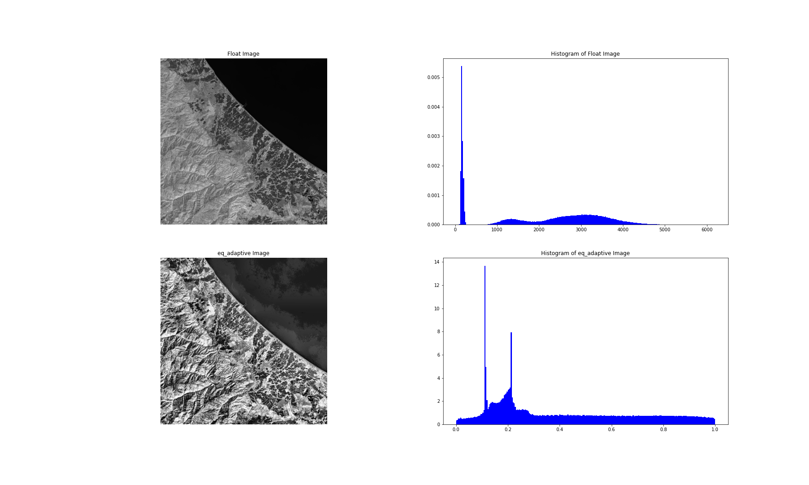
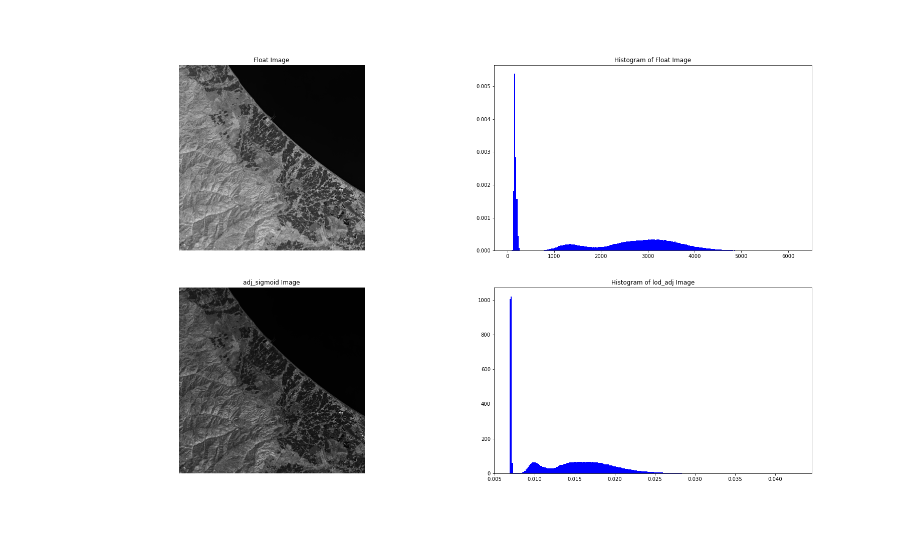
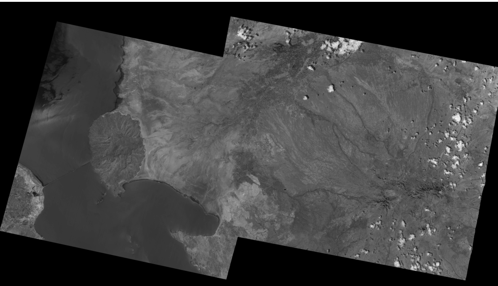
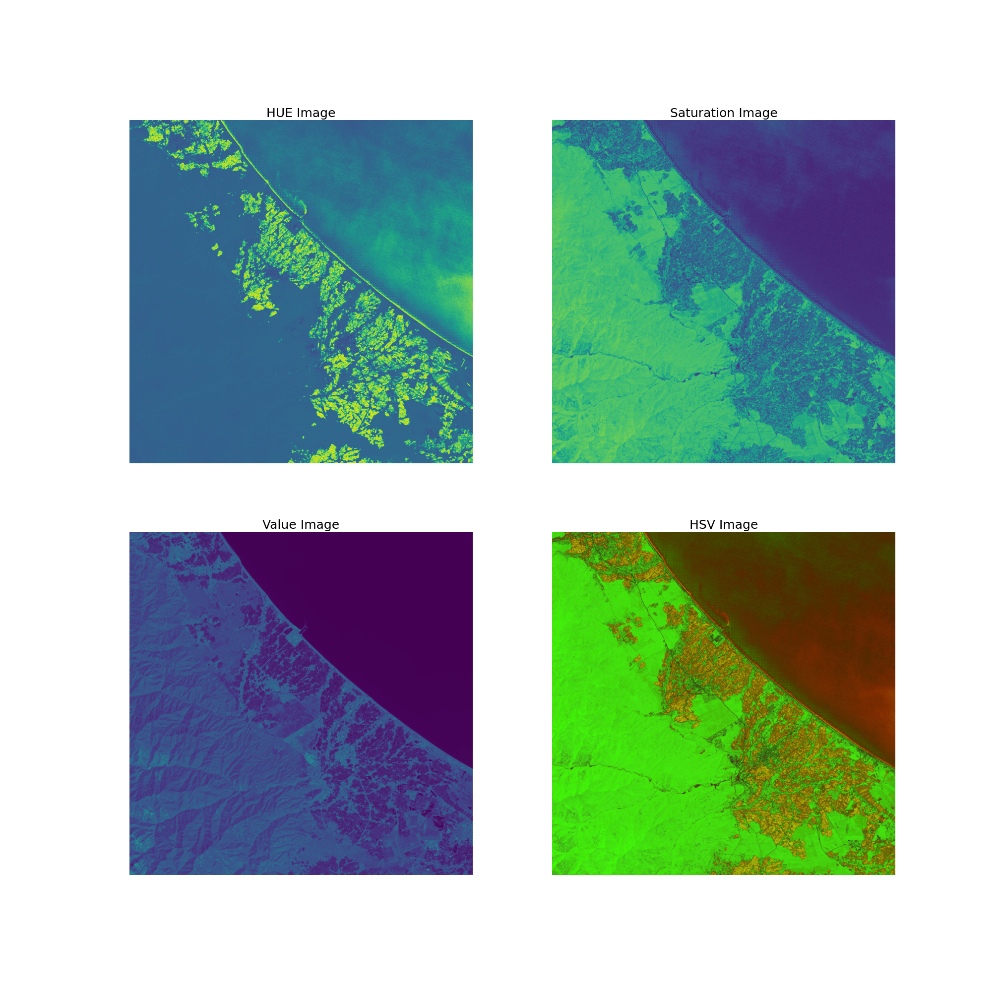

# Virtual-Irrigation
Machine Learning &amp; Image Processing

# Landsat image
Getting landsat images with scikitImage(skimage.io)

# Modis image 

# Geo image

# Aster image

# Image Inhancement
To getting images with their histogram(bios)

# Histogram

# Gamma

# Adjust Logarithm

# Equalize Adaptive

# Equalize Histogram

# Adjust Sigmoid

# Mosaic
merge two mosaic images

# HSV(RGB2HSV)
with skimage(rgb2hsv)

# Spectral profile
#### Using OpenCv and Scikit_Image
https://user-images.githubusercontent.com/78675207/128985724-92295a94-ff6d-4060-9cd5-b942a66cfa64.mp4

